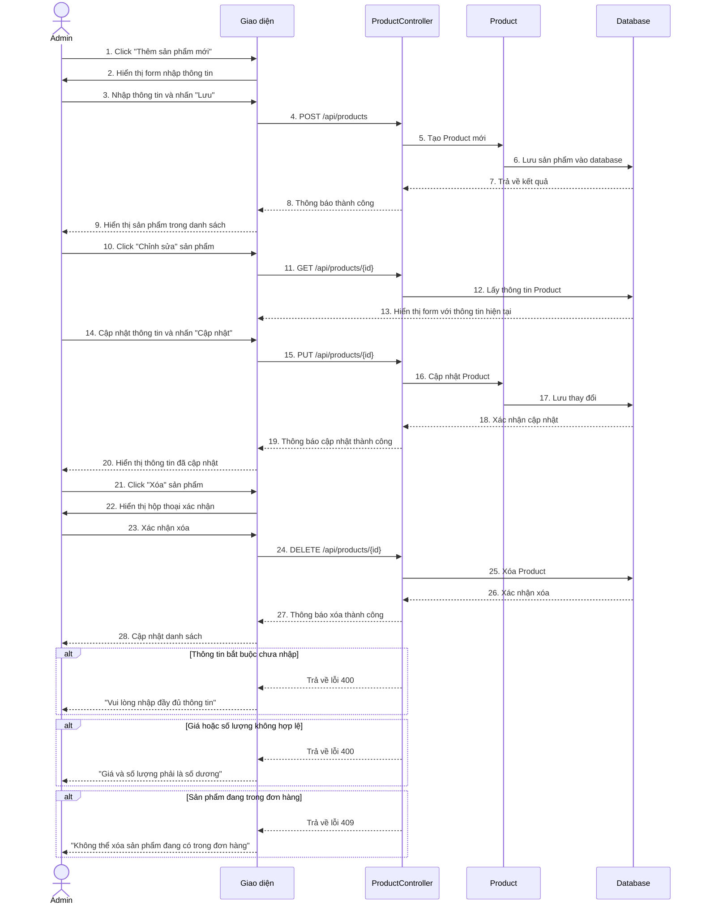

# 2.4.8. Mô tả use case Quản lý sản phẩm

| **Mã Use case** | UC_QuanLySanPham |
|-----------------|------------------|
| **Tên nhân** | Admin |
| **Mô tả** | Admin quản lý sản phẩm thú cưng trong hệ thống (thêm, sửa, xóa) |
| **Sự kiện kích hoạt chính** | Admin truy cập trang quản lý sản phẩm |
| **Tiền điều kiện** | Người dùng đã đăng nhập với vai trò ADMIN |

## Luồng sự kiện chính - Thêm sản phẩm

| # | **Thực hiện bởi** | **Hành động** |
|---|-------------------|---------------|
| 1 | Admin | Truy cập trang /admin/productmanagement và click "Thêm sản phẩm mới" |
| 2 | Hệ thống | Hiển thị form nhập thông tin sản phẩm (tên, loại, giá, số lượng, mô tả, ảnh) |
| 3 | Admin | Nhập thông tin sản phẩm, upload ảnh và nhấn "Lưu" |
| 4 | Hệ thống | Upload ảnh lên Cloudinary, lưu thông tin sản phẩm vào database và hiển thị trong danh sách |

## Luồng sự kiện chính - Sửa sản phẩm

| # | **Thực hiện bởi** | **Hành động** |
|---|-------------------|---------------|
| 1 | Admin | Click nút "Chỉnh sửa" trên sản phẩm cần cập nhật |
| 2 | Hệ thống | Hiển thị form với thông tin hiện tại của sản phẩm |
| 3 | Admin | Cập nhật thông tin (giá, số lượng, mô tả, ảnh mới) và nhấn "Cập nhật" |
| 4 | Hệ thống | Cập nhật thông tin vào database (upload ảnh mới nếu có) và hiển thị thông báo |

## Luồng sự kiện chính - Xóa sản phẩm

| # | **Thực hiện bởi** | **Hành động** |
|---|-------------------|---------------|
| 1 | Admin | Click nút "Xóa" trên sản phẩm cần xóa |
| 2 | Hệ thống | Hiển thị hộp thoại xác nhận "Bạn có chắc muốn xóa sản phẩm này?" |
| 3 | Admin | Xác nhận xóa |
| 4 | Hệ thống | Xóa sản phẩm khỏi database và cập nhật danh sách |

## Luồng sự kiện thay thế

| # | **Thực hiện bởi** | **Hành động** |
|---|-------------------|---------------|
| 5a | Hệ thống | Nếu thông tin bắt buộc (tên, giá, số lượng) chưa nhập thì hiển thị "Vui lòng nhập đầy đủ thông tin" |
| 5b | Hệ thống | Nếu giá hoặc số lượng < 0 thì hiển thị "Giá và số lượng phải là số dương" |
| 5c | Hệ thống | Nếu xóa sản phẩm có trong đơn hàng thì hiển thị "Không thể xóa sản phẩm đang có trong đơn hàng" |

**Hậu điều kiện**: Sản phẩm được cập nhật trong hệ thống và hiển thị cho người mua

## Biểu đồ Sequence - Quản lý sản phẩm

