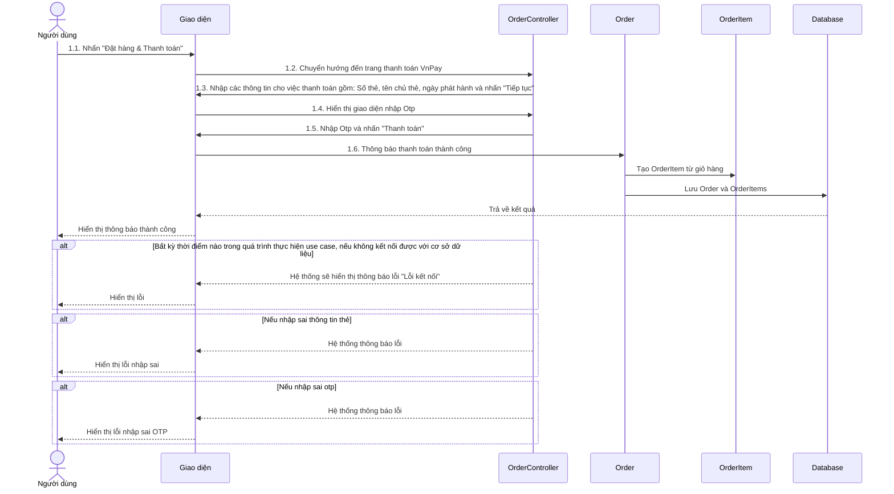
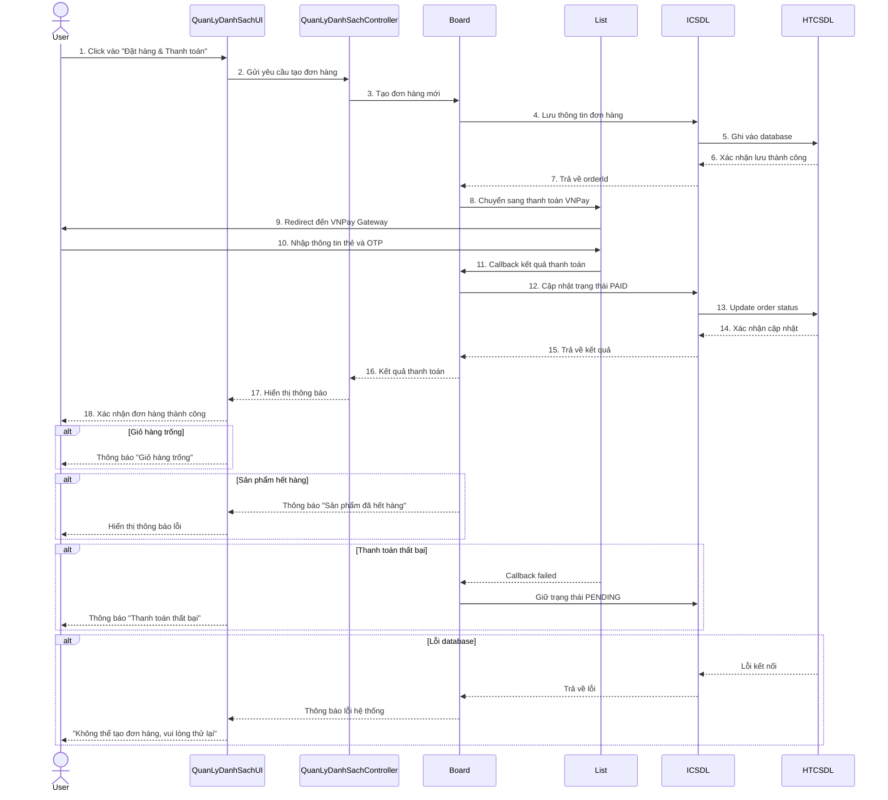

# 2.4.9. Mô tả use case Quản lý đơn hàng

| **Mã Use case** | UC_QuanLyDonHang |
|-----------------|------------------|
| **Tên nhân** | Người dùng (User), Admin |
| **Mô tả** | Quản lý đơn hàng từ khi tạo đến khi hoàn thành |
| **Sự kiện kích hoạt chính** | Người dùng đặt hàng hoặc Admin quản lý đơn hàng |
| **Tiền điều kiện** | Người dùng đã đăng nhập và có sản phẩm trong giỏ hàng |

## Luồng sự kiện chính - Tạo đơn hàng

| # | **Thực hiện bởi** | **Hành động** |
|---|-------------------|---------------|
| 1 | Người dùng | Thêm sản phẩm vào giỏ hàng từ trang /products |
| 2 | Hệ thống | Lưu sản phẩm vào giỏ hàng (ShoppingCart), cập nhật số lượng và tổng tiền |
| 3 | Người dùng | Truy cập /shopping-cart, kiểm tra giỏ hàng và click "Đặt hàng & Thanh toán" |
| 4 | Hệ thống | Tạo đơn hàng (Order) với trạng thái "PENDING", tạo các OrderItem và chuyển sang thanh toán VNPay |

## Luồng sự kiện chính - Theo dõi đơn hàng (User)

| # | **Thực hiện bởi** | **Hành động** |
|---|-------------------|---------------|
| 1 | Người dùng | Truy cập trang /user/orders để xem danh sách đơn hàng |
| 2 | Hệ thống | Hiển thị đơn hàng với trạng thái: PENDING, PAID, PROCESSING, COMPLETED, CANCELLED |
| 3 | Người dùng | Click vào đơn hàng để xem chi tiết sản phẩm, tổng tiền, trạng thái thanh toán |
| 4 | Hệ thống | Hiển thị thông tin chi tiết: Danh sách sản phẩm, số lượng, giá, tổng cộng, ngày đặt |

## Luồng sự kiện chính - Quản lý đơn hàng (Admin)

| # | **Thực hiện bởi** | **Hành động** |
|---|-------------------|---------------|
| 1 | Admin | Truy cập trang /admin/orders để xem tất cả đơn hàng |
| 2 | Hệ thống | Hiển thị danh sách đơn hàng của tất cả khách hàng với thông tin: Mã đơn, Khách hàng, Ngày đặt, Tổng tiền, Trạng thái |
| 3 | Admin | Click vào đơn hàng để xem chi tiết |
| 4 | Hệ thống | Hiển thị chi tiết đơn hàng: Danh sách sản phẩm, thông tin khách hàng, trạng thái thanh toán VNPay |

## Luồng sự kiện thay thế

| # | **Thực hiện bởi** | **Hành động** |
|---|-------------------|---------------|
| 5a | Hệ thống | Nếu giỏ hàng trống thì không cho phép đặt hàng và hiển thị "Giỏ hàng trống" |
| 5b | Hệ thống | Nếu sản phẩm hết hàng thì hiển thị "Sản phẩm đã hết hàng" và loại khỏi giỏ |
| 5c | Hệ thống | Nếu thanh toán thất bại thì giữ đơn hàng ở trạng thái "PENDING" để người dùng thanh toán lại |

**Hậu điều kiện**: Đơn hàng được lưu trữ và theo dõi qua các trạng thái cho đến khi hoàn thành

## Biểu đồ Sequence - Luồng đặt hàng và thanh toán

## Biểu đồ trình tự

