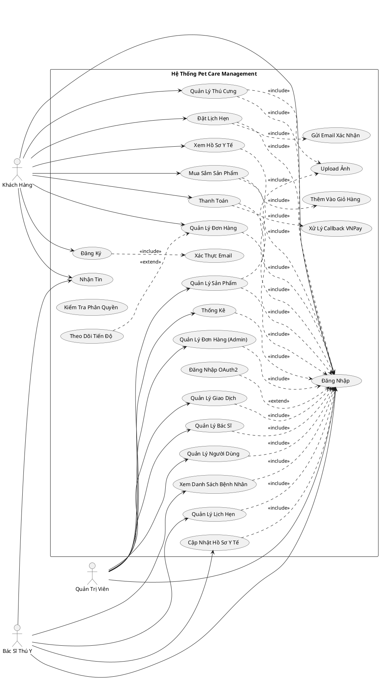

# Biểu đồ Use Case Tổng Quát - Hệ Thống Pet Care Management

## Biểu đồ Use Case

## Mô tả các Use Case

### Actor: Khách Hàng (User)

| **Mã UC** | **Tên Use Case** | **Mô tả** |
|-----------|------------------|-----------|
| UC_2.4.1 | Đăng Ký | Người dùng tạo tài khoản mới trong hệ thống |
| UC_2.4.2 | Đăng Nhập | Đăng nhập bằng tài khoản hoặc OAuth2 (Google/Facebook) |
| UC_2.4.4 | Quản Lý Thú Cưng | Thêm, sửa, xóa thông tin thú cưng, quản lý hồ sơ |
| UC_2.4.3 | Đặt Lịch Hẹn | Đặt lịch khám với bác sĩ thú y |
| - | Xem Hồ Sơ Y Tế | Xem lịch sử khám bệnh, tiêm chủng của thú cưng |
| UC_2.4.8 | Mua Sắm Sản Phẩm | Duyệt và mua sản phẩm chăm sóc thú cưng |
| UC_2.4.7 | Thanh Toán VNPay | Thanh toán đơn hàng qua cổng VNPay |
| UC_2.4.9 | Quản Lý Đơn Hàng | Xem và theo dõi trạng thái đơn hàng |
| - | Nhận Tin | Nhận email thông báo và nhắc nhở |

### Actor: Bác Sĩ Thú Y (Vet)

| **Mã UC** | **Tên Use Case** | **Mô tả** |
|-----------|------------------|-----------|
| UC_2.4.2 | Đăng Nhập | Đăng nhập với tài khoản bác sĩ |
| UC_2.4.3 | Quản Lý Lịch Hẹn | Xem, xác nhận, hủy lịch hẹn |
| - | Cập Nhật Hồ Sơ Y Tế | Ghi nhận chẩn đoán, kê đơn thuốc sau khám |
| - | Xem Danh Sách Bệnh Nhân | Xem danh sách thú cưng đã/sẽ khám |
| - | Nhận Tin | Nhận thông báo về lịch hẹn mới |

### Actor: Quản Trị Viên (Admin)

| **Mã UC** | **Tên Use Case** | **Mô tả** |
|-----------|------------------|-----------|
| UC_2.4.2 | Đăng Nhập | Đăng nhập với quyền admin |
| UC_2.4.6 | Quản Lý Người Dùng | CRUD người dùng, phân quyền vai trò |
| UC_2.4.8 | Quản Lý Sản Phẩm | CRUD sản phẩm, quản lý tồn kho |
| UC_2.4.9 | Quản Lý Đơn Hàng | Xem và cập nhật trạng thái đơn hàng |
| UC_2.4.7 | Quản Lý Giao Dịch | Theo dõi giao dịch thanh toán VNPay |
| UC_2.4.5 | Thống Kê | Xem báo cáo doanh thu, sản phẩm, lịch hẹn |
| - | Quản Lý Bác Sĩ | CRUD thông tin bác sĩ thú y |

## Mối quan hệ Use Case

### Include (bao gồm)
- **Đăng Ký** ←include→ Xác Thực Email
- **Quản Lý Thú Cưng** ←include→ Đăng Nhập
- **Đặt Lịch Hẹn** ←include→ Đăng Nhập
- **Xem Hồ Sơ Y Tế** ←include→ Đăng Nhập
- **Mua Sắm Sản Phẩm** ←include→ Đăng Nhập
- **Thanh Toán** ←include→ Đăng Nhập
- **Quản Lý Đơn Hàng** ←include→ Đăng Nhập
- **Quản Lý Lịch Hẹn (Vet)** ←include→ Đăng Nhập
- **Cập Nhật Hồ Sơ Y Tế** ←include→ Đăng Nhập
- **Xem Danh Sách Bệnh Nhân** ←include→ Đăng Nhập
- **Quản Lý Người Dùng** ←include→ Đăng Nhập
- **Quản Lý Sản Phẩm** ←include→ Đăng Nhập
- **Quản Lý Đơn Hàng (Admin)** ←include→ Đăng Nhập
- **Quản Lý Giao Dịch** ←include→ Đăng Nhập
- **Thống Kê** ←include→ Đăng Nhập
- **Quản Lý Bác Sĩ** ←include→ Đăng Nhập
- **Quản Lý Thú Cưng** ←include→ Upload Ảnh
- **Đặt Lịch Hẹn** ←include→ Gửi Email Xác Nhận
- **Mua Sắm Sản Phẩm** ←include→ Thêm Vào Giỏ Hàng
- **Thanh Toán** ←include→ Xử Lý Callback VNPay
- **Quản Lý Sản Phẩm** ←include→ Upload Ảnh

### Extend (mở rộng)
- **Đăng Nhập** ←extend→ Đăng Nhập OAuth2 (Google/Facebook)
- **Quản Lý Đơn Hàng** ←extend→ Theo Dõi Tiến Độ

## Ghi chú
- Hệ thống hỗ trợ 3 loại người dùng: Khách hàng, Bác sĩ thú y, Admin
- Tất cả actor đều phải đăng nhập để sử dụng các chức năng
- Email thông báo được gửi tự động qua Apache Kafka
- Thanh toán tích hợp VNPay Gateway
- Hình ảnh lưu trữ trên Cloudinary
